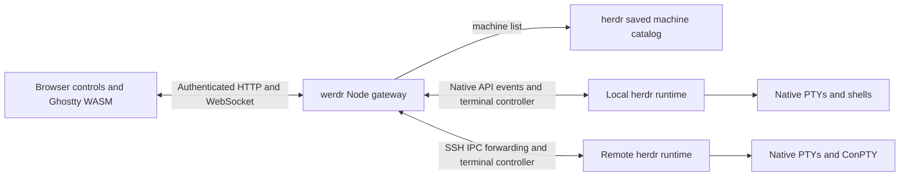

# Browser-client architecture

Werdr keeps herdr's runtime intact and adds a separate web package.
The initial fork base is `4b5e9bda239a0b6903889062d756424578e94691`.
Its multi-machine foundation is upstream PR #3670, merged as `9e9bc8a144667a6b7debfd4f0c7a31ff0e11493a`.

## Ownership

Herdr owns process lifetime, runtime state, workspace/tab/pane identity, agent detection, the SSH catalog, and native terminal parsing.
The gateway authenticates browsers and routes bounded requests to explicit saved machines.
Gateway-only credential and token files remain separate from herdr runtime state.
Username/password or access-token login issues an opaque HttpOnly SameSite cookie; only password-authenticated sessions may rotate the durable access token.
Browser cookies last 90 days and survive gateway restarts through an atomic owner-only versioned store containing token hashes and bounded browser metadata.
Browser-session revocation removes persisted authority and closes the matching terminal controllers immediately while herdr retains the shells.
Token replacement or explicit access-token revocation invalidates token-authenticated sessions; their persisted token fingerprint also prevents resurrection if shutdown interrupts rotation.
The browser owns navigation selection, its viewport, mobile chrome, and display rendering.
Startup and authentication are browser presentation: `BootConsole` owns credential stages and fixed display geometry, while the retained wmux React artwork and desktop components provide the historical visuals.
Text profiles use one Ghostty terminal throughout login; graphical profiles use a DOM input with the same credential stages and matching desktop fields.
The gateway serves only explicitly provisioned private font and screenshot paths; redistributable artwork remains in the web build with its license provenance.
Machine ID plus pane ID identifies a browser target; pane IDs alone are not globally unique.

The gateway launches `herdr terminal session control` with a pinned machine snapshot.
It forwards complete NDJSON records and leaves base64 terminal bytes intact until the browser passes them to Ghostty.
Browser disconnection releases the controller rather than closing the pane.
Takeover is an explicit action and is never part of automatic reconnect.
Herdr's rendered frames are authoritative; a `full` frame is not permission to reset a live terminal or replay a raw PTY tail.

`Fleet` owns independent metadata connections, bounded handshake concurrency, reconnect backoff, and ordered browser deltas.
It subscribes before taking native snapshots, reconciles changes during bootstrap, subscribes to per-pane agent status, and takes a ten-second health snapshot.
Local metadata uses the existing Unix socket; POSIX SSH forwards that socket to an owner-only temporary directory.
Windows SSH multiplexes bounded channels to the existing named pipe through a PowerShell/C# IPC client.
Neither path adds a TCP listener or a second session runtime.
Agent status transitions create bounded, atomically persisted notification history; bootstrap does not announce existing work.
Notifications cover observed transitions while the gateway is running, rather than reconstructing events missed during downtime.
The browser applies ordered fleet revisions and resynchronizes after gaps or reconnects.
Host identity is pinned across in-flight operations, and disabling/removing a host retires metadata and terminal clients without terminating native sessions.

`MachineManagement` serializes browser catalog edits and setup jobs while retaining the last valid catalog during temporary failures.
POSIX onboarding delegates compatibility and installation decisions to the upstream interactive CLI.
Windows onboarding stages the fork's checksum-pinned installer only after explicit consent and never forcibly replaces a running runtime.
Platform hints are separate from the native catalog and only apply while ID, target, and named session match.
Setup logs and input are bounded, jobs are scoped to their browser-session owner, and session revocation cancels their work.
The browser action adapter exposes an explicit native-method allowlist instead of a general RPC proxy.

## Why a fork

Shared history permits normal upstream merges and focused integration of open PRs.
Browser-specific files live under `web/`; fork documentation and maintenance helpers live under `werdr/` plus `WERDR.md`.
Upstream source and release files need no initial modifications.
Future native fixes should be small independent commits with characterization tests and removal conditions.

Herdr plugins package executable workflows, hooks, and panes.
A plugin may eventually launch the gateway, but it does not replace the browser-client transport or runtime extension boundary.
Avoid duplicating wmux's session-agent processes, persistence stores, or host inventory inside werdr.

## Two Ghostty implementations

Herdr's native `vendor/libghostty-vt` parses process output and participates in runtime rendering.
The browser uses wmux's patched `ghostty-web` package, pinned under `web/vendor/ghostty-web-pr169`.
Their revisions and patch sets are independent.
Preserve herdr's native patch ledger and the browser package's provenance separately.
