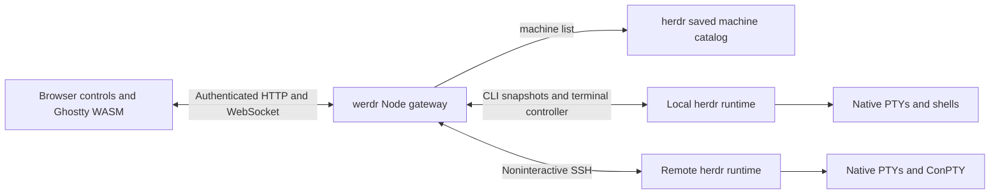

# Browser-client architecture

Werdr keeps herdr's runtime intact and adds a separate web package.
The initial fork base is `4b5e9bda239a0b6903889062d756424578e94691`.
Its multi-machine foundation is upstream PR #3670, merged as `9e9bc8a144667a6b7debfd4f0c7a31ff0e11493a`.

## Ownership

Herdr owns process lifetime, runtime state, workspace/tab/pane identity, agent detection, the SSH catalog, and native terminal parsing.
The gateway authenticates browsers and routes bounded requests to explicit saved machines.
The browser owns navigation selection, its viewport, mobile chrome, and display rendering.
Machine ID plus pane ID identifies a browser target; pane IDs alone are not globally unique.

The gateway launches `herdr terminal session control` with a pinned machine snapshot.
It forwards complete NDJSON records and leaves base64 terminal bytes intact until the browser passes them to Ghostty.
Browser disconnection releases the controller rather than closing the pane.
Takeover is an explicit action and is never part of automatic reconnect.
Herdr's rendered frames are authoritative; a `full` frame is not permission to reset a live terminal or replay a raw PTY tail.

The first version uses CLI wrappers for cross-platform API transport instead of duplicating Unix-socket and Windows-named-pipe handling.
It polls selected-host metadata, while terminal output remains streamed.
A later event-driven cache should subscribe before taking a snapshot, buffer intervening events, and resynchronize after reconnect as specified by herdr's socket API.

## Why a fork

Shared history permits normal upstream merges and focused integration of open PRs.
Browser-specific files live under `web/`; fork documentation and maintenance helpers live under `werdr/` plus `WERDR.md`.
Upstream source and release files need no initial modifications.
Future native fixes should be small independent commits with characterization tests and removal conditions.

Herdr plugins package executable workflows, hooks, and panes.
A plugin may eventually launch the gateway, but it does not replace the browser-client transport or runtime extension boundary.
Avoid duplicating wmux's session-agent processes, persistence stores, or host inventory inside werdr.

## Two Ghostty implementations

Herdr's native `vendor/libghostty-vt` parses process output and participates in runtime rendering.
The browser uses wmux's patched `ghostty-web` package, pinned under `web/vendor/ghostty-web-pr169`.
Their revisions and patch sets are independent.
Preserve herdr's native patch ledger and the browser package's provenance separately.
